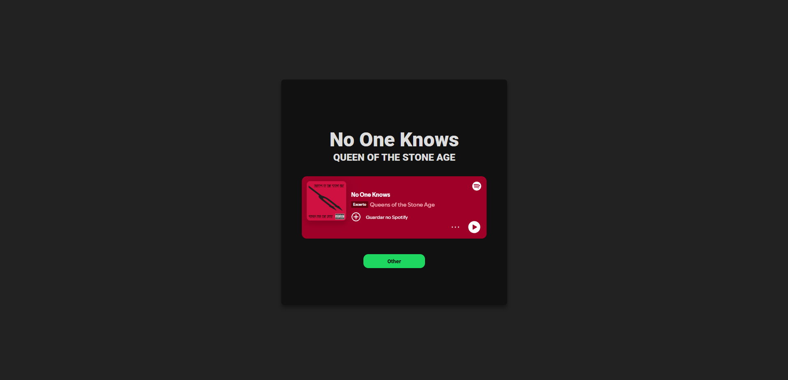
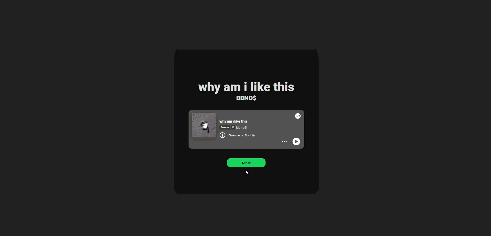

# Random Spotify Music Player
In this Spotify random music player, you can discover new music! Also... the songs are added by me, so... you might like some of them :D

You can try it [Here](http://brundevcoder.github.io/random-music)

## How does it work?
First, there's an array on the js called `musics`, wich contains the necessary data for each song, including the name, artist, and Spotify's internal code

Which follows this structure:

- `{"Song": "You Give Love A Bad Name", "Artist": "Bon Jovi", "Id": "0rmGAIH9LNJewFw7nKzZnc"}`

Or more specifically:

- `{"Song": "SONG_NAME", "Artist": "ARTIST_NAME", "Id": "SPOTIFY_MUSIC_CODE"}`

The code takes all this data and simply displays it on your screen.

Furthermore, using the [website](http://brundevcoder.github.io/random-music) is very simple! Just click on "Other" while you find a song, and you'll discover new ones! Just like this:

## How to run it
Simply clone this repo and open the `index.html` file, or use the Live Server extension in Vs Code, or just test it [here](http://brundevcoder.github.io/random-music)